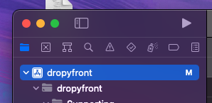
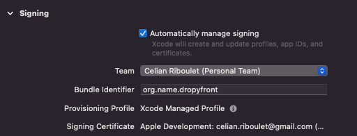
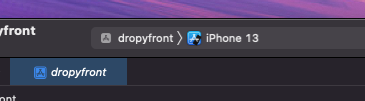
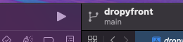

## Setup projet :

### MacOS

- Installer nvm (node version manager) : `brew install nvm`
  
  - `nvm install --lts` Pour installer un version "long term support" de node
  - `nvm alias default system` Pour dire que la version par défaut de nvm est celle sur le système

- Installer Xcode depuis l'app store

- Clone le projet

- Intaller les dépendances : `npm i`

- Installer les dépendances cocoapods (IOS) : `sudo gem install cocoapods`

- Lancer xcode et ouvrir le **dossier ios** qui se trouve dans le projet.

- Cliquer sur le projet : 
  
  - 

- Aller dans "Signing & Capabilities"
  
  - Choisir une Team (Compte Apple)
  
  - 

- Sélectionner un simulateur 
  
  - 

- Lancer la commande `ln -s $(which node) /usr/local/bin/node`

- Lancer une build
  
  - 
